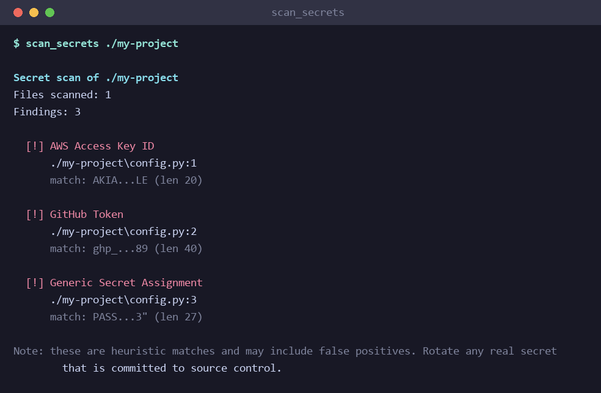
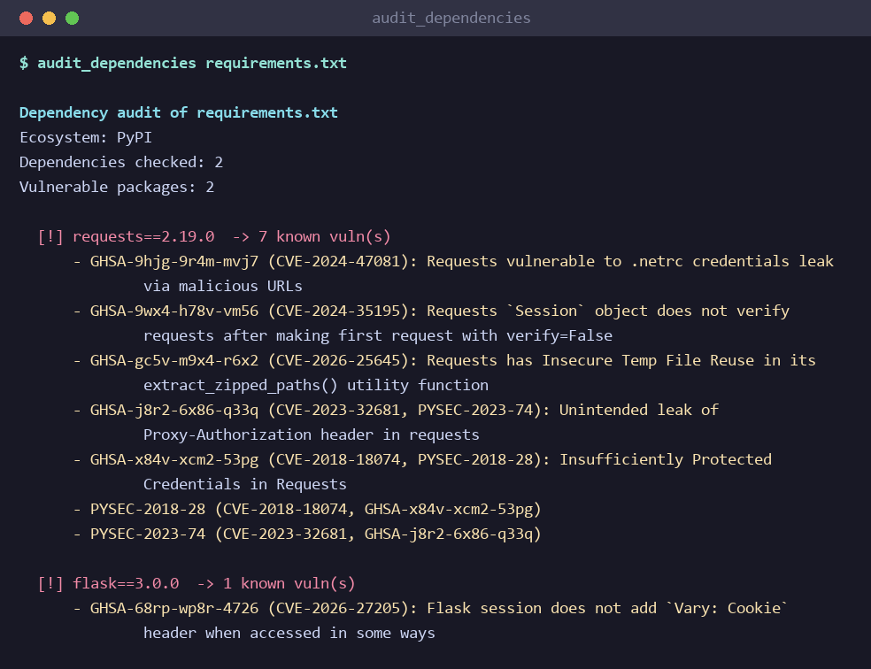
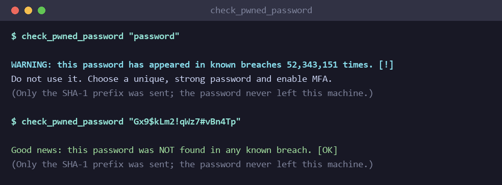

<div align="center">

# 🛡️ GuardX

**A keyless, defensive (blue-team) code-security auditor for the [Model Context Protocol](https://modelcontextprotocol.io).**
Let your AI assistant scan codebases for secrets, audit dependencies for known CVEs, and check passwords against breach data — all from natural language.

[](https://www.python.org/)
[](https://modelcontextprotocol.io)
[](LICENSE)
[]()
[]()
[]()

</div>

---

> ⚠️ **Defensive use only.** Every tool is **read-only**, **privacy-preserving**, and needs **no API keys**. Use it only on code and credentials you own or are authorized to assess.

Unlike offensive recon tools that probe live websites, this server inspects **your own code and credentials** — making it the blue-team companion to your red-team tooling.

## Table of Contents

- [Features](#features)
- [Screenshots](#screenshots)
- [Installation](#installation)
- [Connect to an MCP Client](#connect-to-an-mcp-client)
- [Usage](#usage)
- [Sample output](#sample-output)
- [How the Privacy-Safe Password Check Works](#how-the-privacy-safe-password-check-works)
- [Data sources](#data-sources)
- [Tool Reference](#tool-reference)
- [Project Structure](#project-structure)
- [Troubleshooting](#troubleshooting)
- [Contributing](#contributing)
- [License](#license)

## Features

- 🔑 **Secret scanning** — detect hardcoded AWS keys, GitHub/Slack tokens, private keys, JWTs, and generic credentials. Findings are **masked**, so reports are safe to share.
- 📦 **Dependency auditing** — check `requirements.txt` (PyPI) and `package.json` (npm) against the free [OSV.dev](https://osv.dev) vulnerability database.
- 🔐 **Breached-password check** — query [Have I Been Pwned](https://haveibeenpwned.com/Passwords) using **k-anonymity**; the password never leaves your machine.
- 🚫 **No API keys, no accounts** — clone, install, run.
- 🤖 **Native MCP** — works with Claude Code, Claude Desktop, Gemini CLI, OpenAI Codex, Cursor, and any MCP client.

## Screenshots

### 🔑 Scan a project for hardcoded secrets
<p align="center">
  
</p>

### 📦 Audit dependencies against the OSV vulnerability database
<p align="center">
  
</p>

### 🔐 Check whether a password has been breached
<p align="center">
  
</p>

## Installation

```bash
git clone https://github.com/harshzagade/Guardx-mcp.git
cd Guardx-mcp

# (recommended) create a virtual environment
python -m venv .venv
# Windows:
.venv\Scripts\activate
# macOS / Linux:
source .venv/bin/activate

pip install -r requirements.txt
```

**Requirements:** Python 3.10+ and the `mcp` + `httpx` packages (installed via `requirements.txt`).

## Connect to an MCP Client

GuardX runs locally over **stdio**, so any MCP-capable client can launch it. In every example below, replace `/absolute/path/to/guardx-mcp/server.py` with the real path on your machine. If you used a virtual environment, point `command` at that env's Python (e.g. `.venv/bin/python` or `.venv\Scripts\python.exe`) instead of `python`.

> 💡 First, confirm the server starts on its own (it then waits for a client on stdin — press `Ctrl+C` to exit):
> ```bash
> python server.py
> ```

<details open>
<summary><b>Claude Code</b> (CLI)</summary>

Register the server with one command:

```bash
claude mcp add guardx -- python /absolute/path/to/guardx-mcp/server.py
```

- Add `--scope project` to write it to a shared `.mcp.json` in your repo.
- Verify with `claude mcp list`, then use `/mcp` inside Claude Code.

</details>

<details>
<summary><b>Claude Desktop</b> (app)</summary>

Edit your `claude_desktop_config.json`:

- **macOS:** `~/Library/Application Support/Claude/claude_desktop_config.json`
- **Windows:** `%APPDATA%\Claude\claude_desktop_config.json`

```json
{
  "mcpServers": {
    "guardx": {
      "command": "python",
      "args": ["/absolute/path/to/guardx-mcp/server.py"]
    }
  }
}
```

Restart Claude Desktop; GuardX appears under the 🔌 tools menu.

</details>

<details>
<summary><b>Gemini CLI</b> (& Gemini Code Assist)</summary>

Edit `~/.gemini/settings.json` (global) or `.gemini/settings.json` (per-project). The Gemini Code Assist IDE extension reads the same file:

```json
{
  "mcpServers": {
    "guardx": {
      "command": "python",
      "args": ["/absolute/path/to/guardx-mcp/server.py"]
    }
  }
}
```

Then run `gemini` and use `/mcp` to confirm the server is connected.

</details>

<details>
<summary><b>OpenAI Codex</b> (CLI & IDE extension)</summary>

Codex uses **TOML** and shares config between the CLI and the IDE extension. Either run:

```bash
codex mcp add guardx -- python /absolute/path/to/guardx-mcp/server.py
```

…or hand-edit `~/.codex/config.toml` ( note the **underscore** in `mcp_servers`):

```toml
[mcp_servers.guardx]
command = "python"
args = ["/absolute/path/to/guardx-mcp/server.py"]
```

> Codex only supports **local stdio** MCP servers — perfect for GuardX.

</details>

<details>
<summary><b>Cursor</b> / <b>VS Code</b></summary>

Create `.cursor/mcp.json` in your project (or the global `~/.cursor/mcp.json`):

```json
{
  "mcpServers": {
    "guardx": {
      "command": "python",
      "args": ["/absolute/path/to/guardx-mcp/server.py"]
    }
  }
}
```

VS Code (with MCP support) uses the same `mcpServers` shape in its settings.

</details>

> **Windows tip:** in JSON, write paths with forward slashes (`C:/Users/you/guardx-mcp/server.py`) or escaped backslashes (`C:\\Users\\you\\...`).

## Usage

Once connected, just ask your assistant in plain language:

| You say... | Tool used |
| --- | --- |
| *"Scan `./my-project` for hardcoded secrets"* | `scan_secrets` |
| *"Audit `requirements.txt` for known vulnerabilities"* | `audit_dependencies` |
| *"Has the password `password123` been pwned?"* | `check_pwned_password` |

## Sample output

Real output from running the tools (secrets shown are intentionally fake):

**`scan_secrets("demo-project")`**

```
Secret scan of demo-project
Files scanned: 1
Findings: 2

  [!] AWS Access Key ID
      demo-project/app.py:1
      match: AKIA...LE (len 20)

  [!] Stripe Secret Key
      demo-project/app.py:2
      match: sk_l...dc (len 32)

Note: these are heuristic matches and may include false positives. Rotate any real secret that is committed to source control.
```

**`audit_dependencies("requirements.txt")`** — with `requests==2.28.0` and `urllib3==1.26.0` pinned:

```
Dependency audit of requirements.txt
Ecosystem: PyPI
Dependencies checked: 2
Vulnerable packages: 2

  [!] requests==2.28.0  -> 8 known vuln(s)
      - GHSA-9hjg-9r4m-mvj7 (CVE-2024-47081, PYSEC-2026-1872): Requests vulnerable to .netrc credentials leak via malicious URLs
      - GHSA-9wx4-h78v-vm56 (CVE-2024-35195, PYSEC-2026-1873): Requests `Session` object does not verify requests after making first request with verify=False
      - GHSA-gc5v-m9x4-r6x2 (CVE-2026-25645, PYSEC-2026-2275): Requests has Insecure Temp File Reuse in its extract_zipped_paths() utility function
      ...

  [!] urllib3==1.26.0  -> 24 known vuln(s)
      - GHSA-2xpw-w6gg-jr37 (CVE-2025-66471, PYSEC-2026-1994): urllib3 streaming API improperly handles highly compressed data
      ...
```

**`check_pwned_password("password123")`**

```
WARNING: this password has appeared in known breaches 2,266,543 times. [!]
Do not use it. Choose a unique, strong password and enable MFA.
(Only the SHA-1 prefix was sent; the password never left this machine.)
```

A password not found in any breach returns `Good news: this password was NOT found in any known breach. [OK]`.

## How the Privacy-Safe Password Check Works

`check_pwned_password` follows the [k-anonymity model](https://haveibeenpwned.com/API/v3#PwnedPasswords) recommended by Have I Been Pwned:

1. The password is hashed locally with **SHA-1**.
2. Only the **first 5 hex characters** of the hash are sent to the HIBP range API.
3. The API returns all hash suffixes sharing that prefix; the match is found **locally**.

➡️ Your password and its full hash **never leave your machine**.

## Data sources

- **Vulnerabilities:** `audit_dependencies` queries the [OSV.dev](https://osv.dev) API **live on every run** — there is no local vulnerability database to download or refresh, so results reflect the latest published advisories at query time. Each query sends only `{package name, version, ecosystem}`. Internet access is required; lookups that fail (network error or non-200 response) are reported in the output rather than silently dropped.
- **Breached passwords:** `check_pwned_password` uses the [Have I Been Pwned Pwned Passwords API](https://haveibeenpwned.com/API/v3#PwnedPasswords) with k-anonymity (see above). Internet access is required.

## Tool Reference

| Tool | Signature | Description |
| --- | --- | --- |
| **Secret scanner** | `scan_secrets(path, max_findings=200)` | Recursively scans a file or directory for hardcoded secrets. Skips binaries and common ignore dirs (`.git`, `node_modules`, …). Returns masked findings with file and line number. |
| **Dependency auditor** | `audit_dependencies(path)` | Parses a `requirements.txt` or `package.json` and checks each pinned dependency against OSV.dev. Returns CVE/GHSA ids and summaries. |
| **Pwned-password check** | `check_pwned_password(password)` | Checks a password against HIBP via k-anonymity. Reports breach count without transmitting the password. |

## Project Structure

```
guardx-mcp/
├── server.py          # MCP server + the three tools
├── requirements.txt   # runtime dependencies (mcp, httpx)
├── assets/            # README screenshots
├── README.md
├── CHANGELOG.md
├── LICENSE            # MIT
└── .gitignore
```

## Troubleshooting

- **`ModuleNotFoundError: No module named 'mcp.server.fastmcp'`** — you installed `mcp` 2.x, which renamed `FastMCP` to `MCPServer`. GuardX targets the 1.x SDK, so pin it in your venv:
  ```bash
  pip install "mcp<2" httpx
  ```
- **`audit_dependencies` / `check_pwned_password` report network failures** — both tools need internet access (OSV.dev and Have I Been Pwned respectively). Corporate proxies may need to be configured in your environment.

## Contributing

Contributions are welcome! Ideas: more secret patterns, additional ecosystems
(Go modules, Cargo, Maven), or an SBOM export. Please keep all contributions
**defensive** in nature. Open an issue or a pull request.

## License

Released under the [MIT License](LICENSE).

---

<div align="center">
<sub>Built as a defensive blue-team companion. Scan responsibly. 🛡️</sub>
</div>
